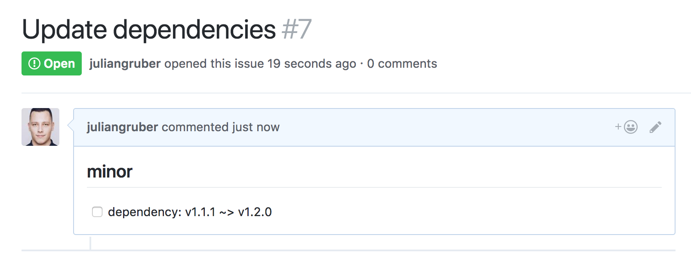

# hubdated

List outdated git dependencies in your private GitHub repos.

Tag your commits with `#vMAJOR.MINOR.PATCH` and this will use the semver module to find dated dependencies.

## Usage

Pass a Github API token and organisation name: 

```bash
$ TOKEN=xxx hubdated ORG [FILTER]
```

Example:

```bash
$ TOKEN=xxx hubdated test123xyzlkj

# test123xyzlkj/dependant

## minor

- [ ] dependency: v1.1.1 ~> v1.2.0

$ echo $?
1
```

The output is formatted as Markdown, so it can be used to easily create a GitHub issue:



Pass the optional `FILTER` argument to perfom fuzzy matching on the dependencies to check:

```bash
$ hubdated test123xyzlkj express,lodash
```

For repeated use, you can also store your token in `~/.hubdated`:

```bash
$ echo xxx > ~/.hubdated
$ hubdated ORG
```

## Installation

```bash
$ npm install -g hubdated
```

## API

```js
const hubdated = require('hubdated')

hubdated({
  token,
  org,
  filter = [],
  each: ({ repo, deps }) => {
    for (const dep of deps) {
      slack(`${repo} uses an out of date version of ${dep.repo}. ${dep.from} vs ${dep.to}`)
    }
  }
})
  .then(code => process.exit(code))
  .catch(err => {
    console.error(err)
    process.exit(1)
  })
```

## License

MIT
